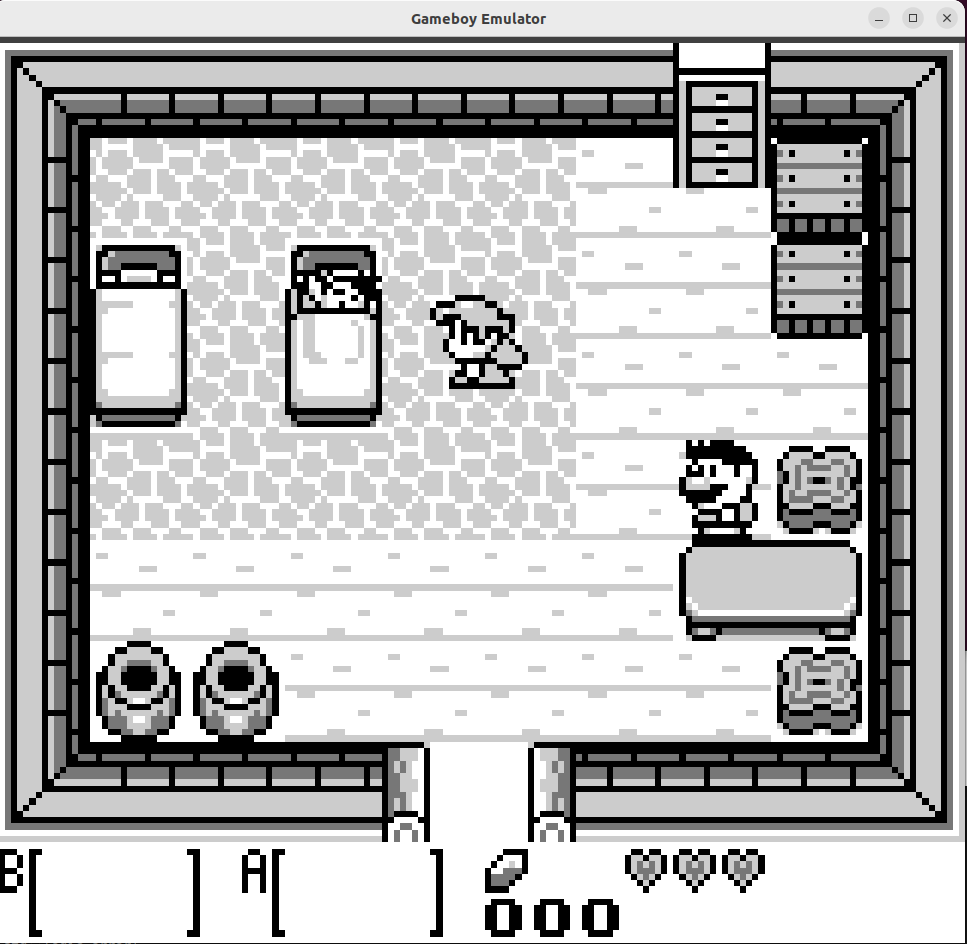
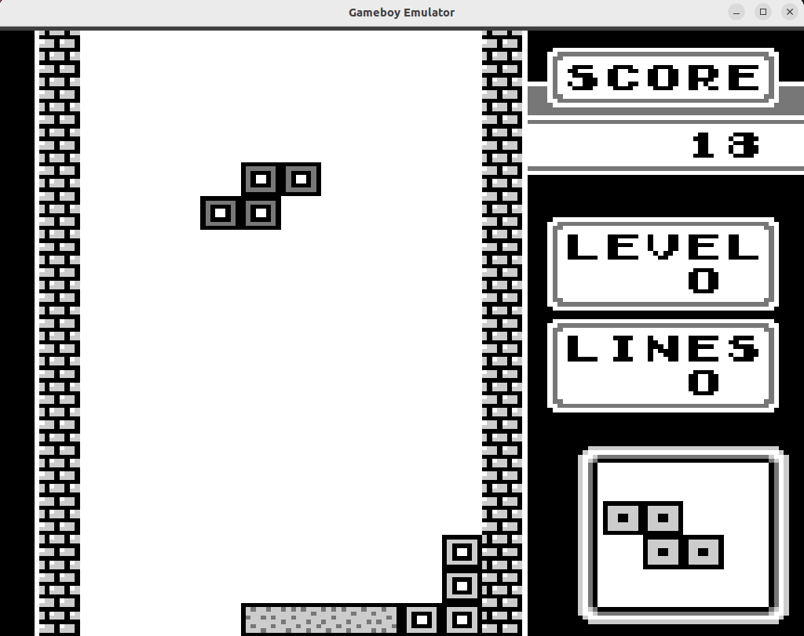

# GBEmu

GBEmu is a simple Gameboy emulator written in C++ using the SFML library. It allows you to play Gameboy ROMs on your computer. Please note that this emulator does not support sound.

## Installation

To build and run GBEmu, follow these steps:

1. Clone the repository to your local machine.
2. Make sure you have CMake installed.
3. Open a terminal and navigate to the project directory.
4. Run the following commands:

```shell
mkdir build
cd build
cmake ..
make
```

## Usage

To run GBEmu, use the following command in your terminal:

```shell
./GBEmu/bin/Emulator /path/to/rom.gb
```

Replace `/path/to/rom.gb` with the actual path to your Gameboy ROM file.

## Controls

The controls for GBEmu are as follows:

- WASD: Directional keys
- J: A button
- K: B button

## Disclaimer

Please note that GBEmu is a basic emulator and does not support all ROMs and features of the Gameboy.

## Screenshots
### Zelda


### Tetris

